# Atomics Estimate Engine — Complete Flowcharts (v2)

Paste any diagram into https://mermaid.live to edit.

---

## 1 · Complete three-level request lifecycle

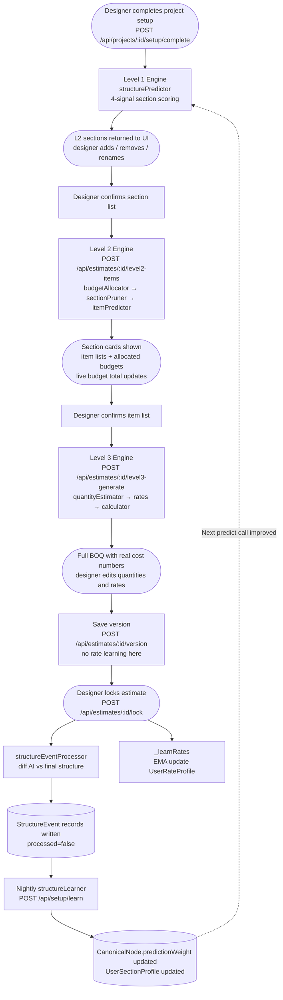

---

## 2 · Level 1 — structurePredictor internal flow

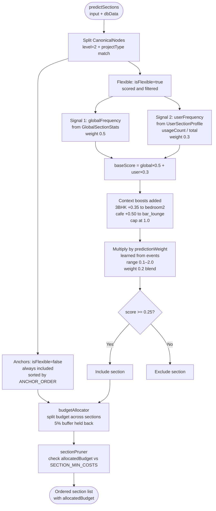

---

## 3 · Level 2 — itemPredictor + real-time budget

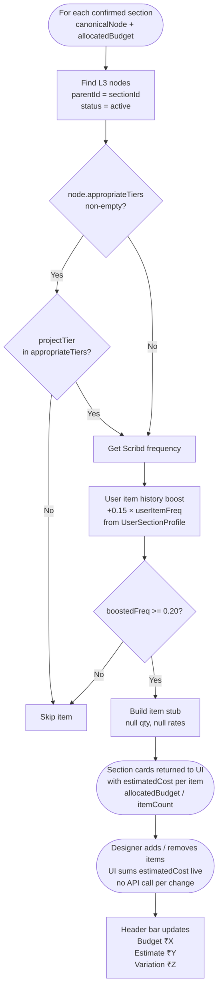

---

## 4 · Level 3 — quantityEstimator + calculator pipeline

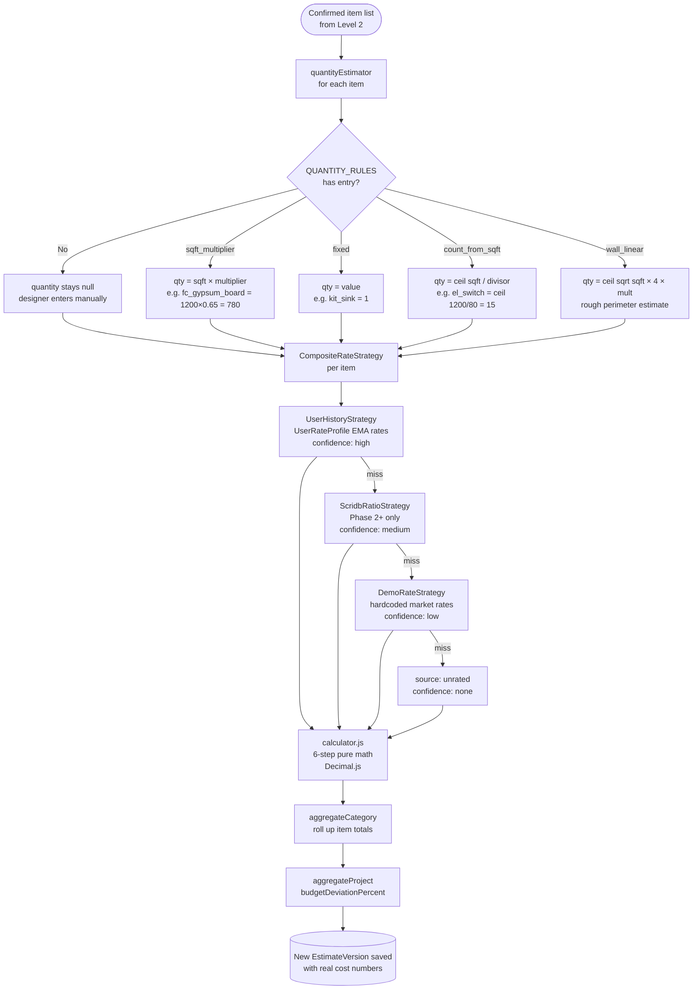

---

## 5 · Rate strategy chain — CompositeRateStrategy

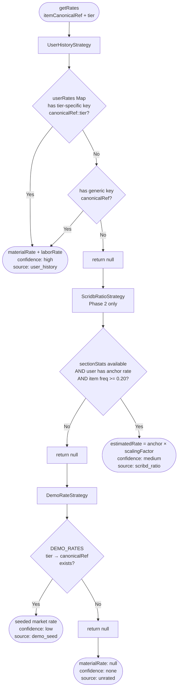

---

## 6 · Calculator — 6-step cost stack

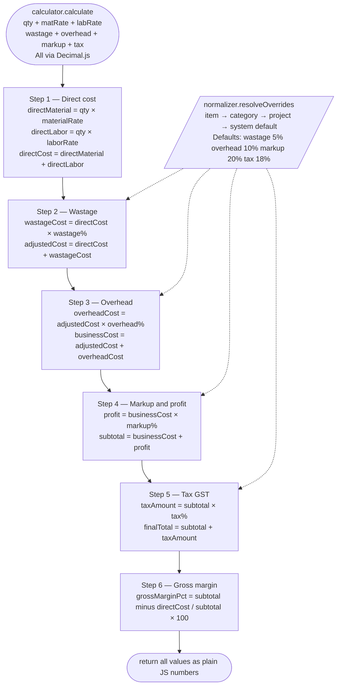

---

## 7 · Lock → structureEventProcessor → learning events

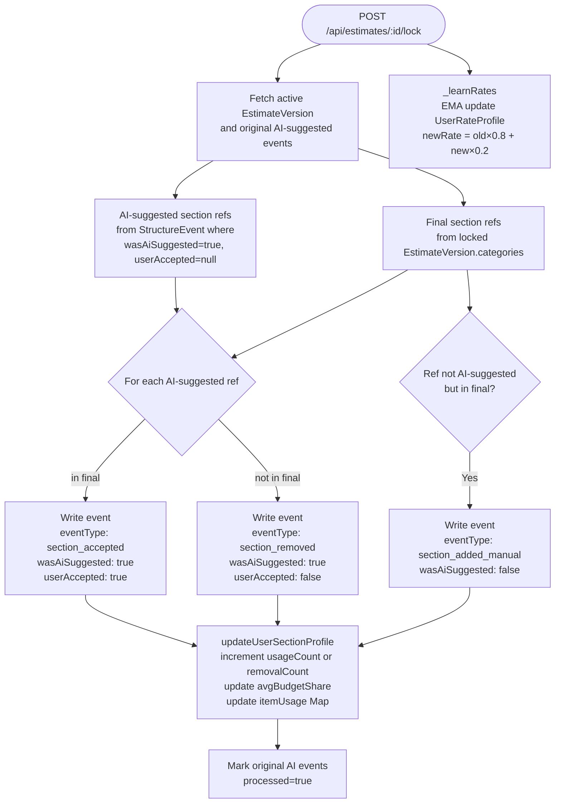

---

## 8 · Nightly structureLearner

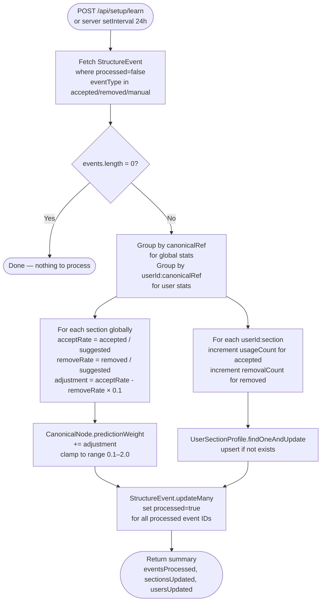

---

## 9 · Upload past estimate — onboarding and rate + profile bootstrap

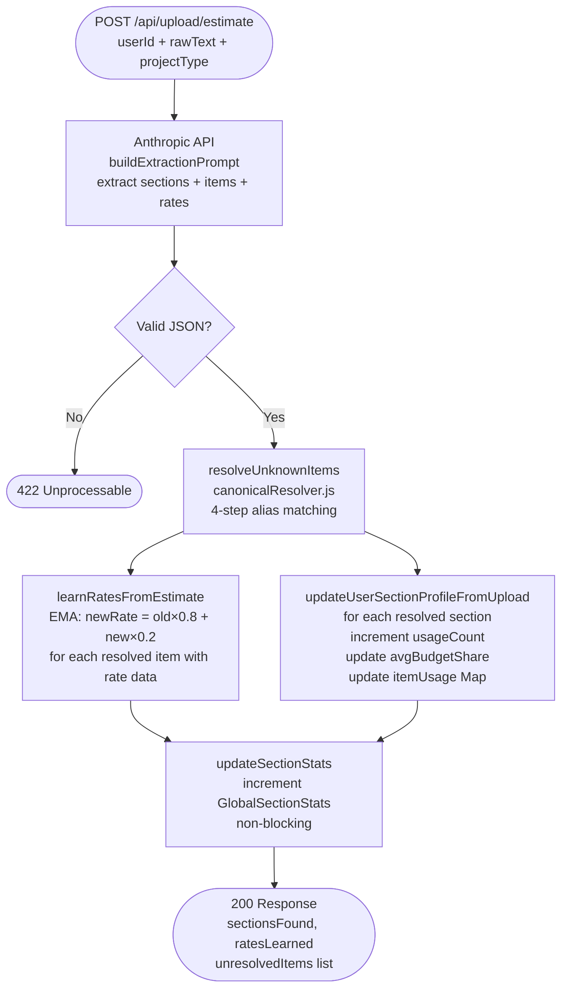

---

## 10 · Data model relationships

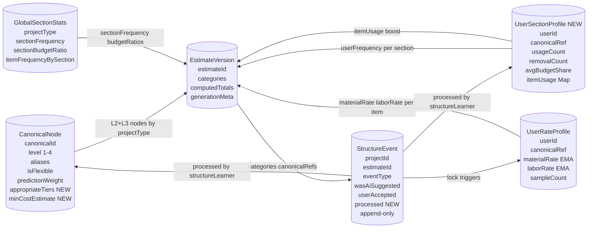

---

## 11 · Section pruner decision

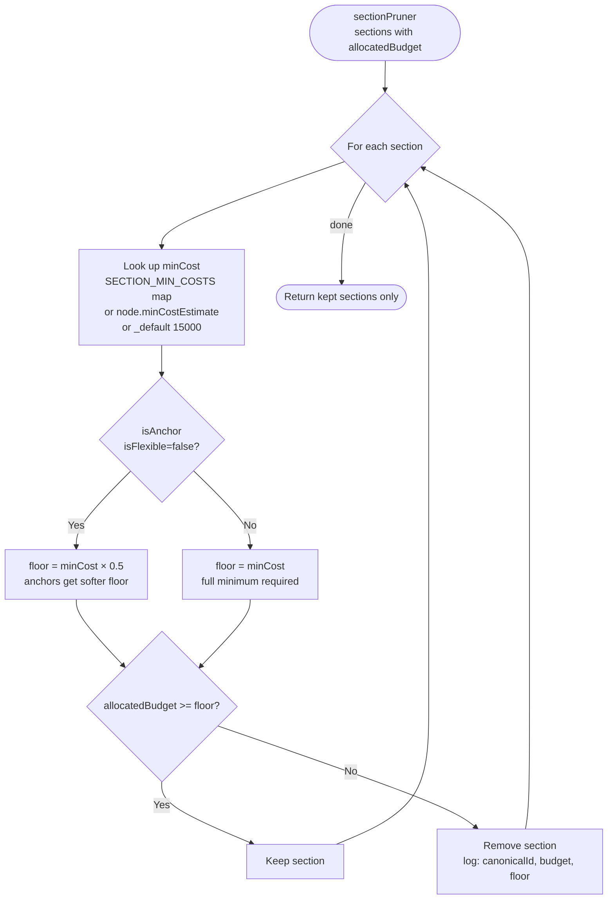

---

## 12 · quantityEstimator rule application

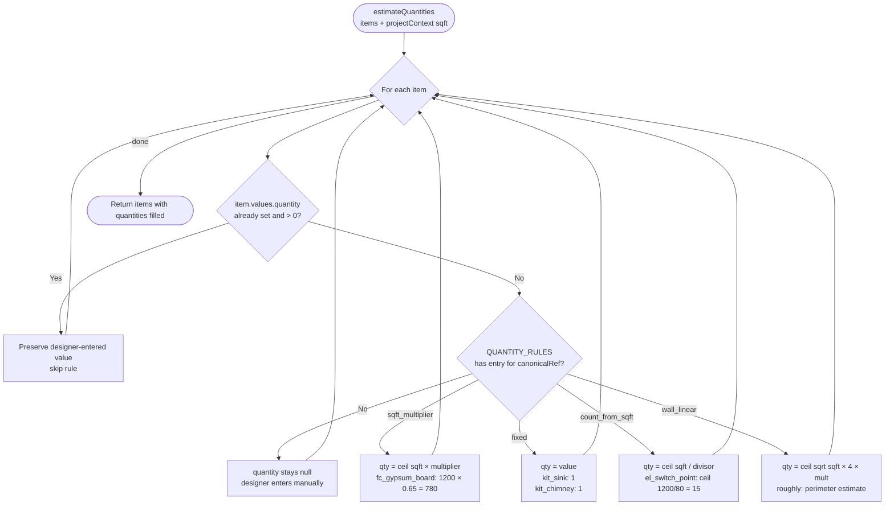
